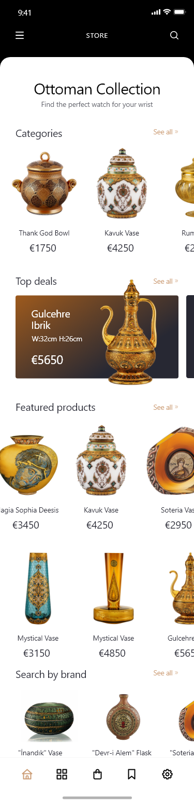

# Antiquities-app

It's a readable, maintainable, and sustainable App. I started coding from scratch to build a clean architecture project with MVVM. I built the presentation layer, data layer, domain layer, and application layer step by step. This architecture is designed to make it easier to create stable apps even when outer elements such as UI, databases, or external APIs are always changing. It’s essentially a collection of best practice design principles that help you keep business logic, or domain logic, together and minimize the dependencies within the system.

I used Mocklab to make a mock API and used some packages to handle it like retrofit, analyzer, dio, json serializable, dartz, internet connection checker, pretty dio logger, shared preferences, freezer, and getit. and to support different languages, I used easy localization to handle it.

